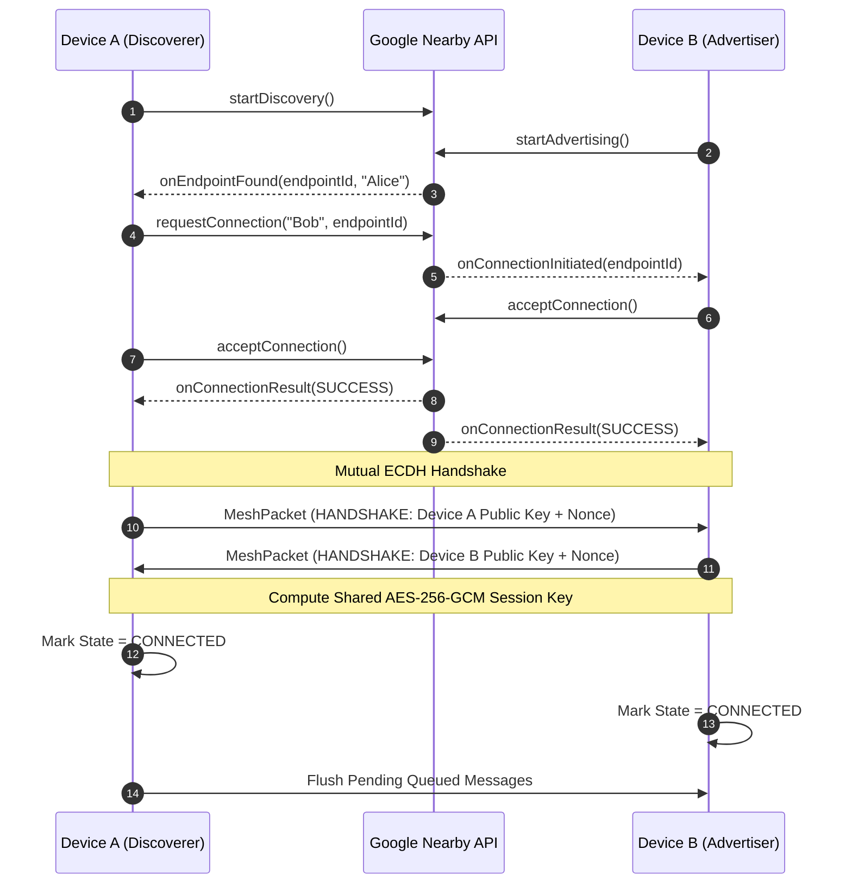
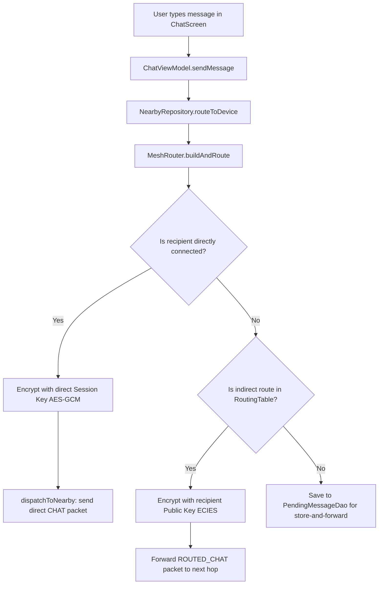
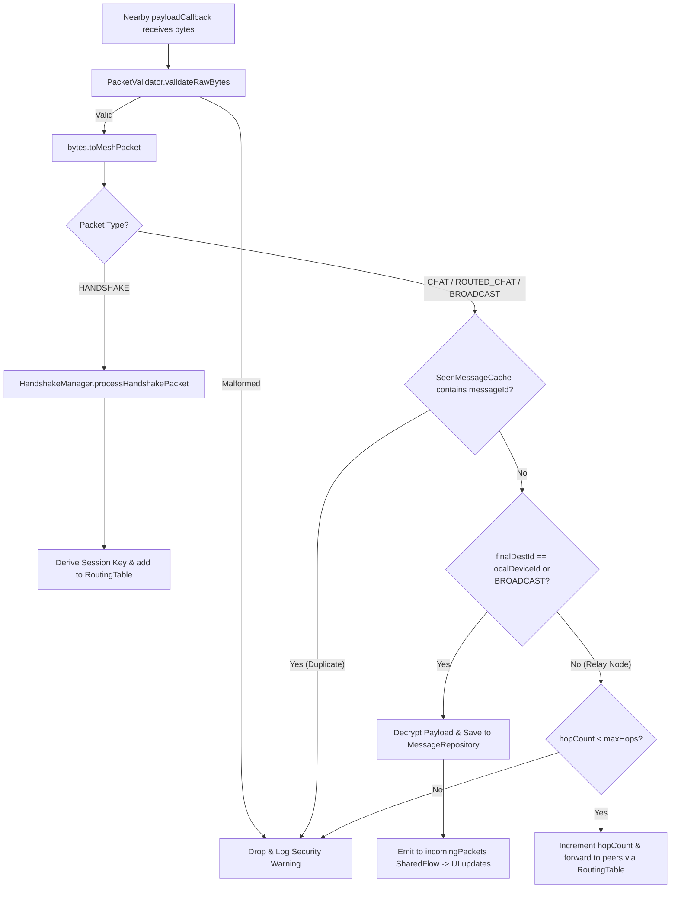

# MeshLink — Project Architecture & Developer Guide (`PROJECT.md`)

Welcome to the **MeshLink** development guide. This document is designed to give you a comprehensive overview of the architecture, codebase organization, core workflows, and actionable entry points so you know exactly where and how to start making updates.

---

## 📑 Table of Contents

1. [Project Overview & Core Principles](#-project-overview--core-principles)
2. [Module Architecture & Dependency Graph](#-module-architecture--dependency-graph)
3. [Deep Dive by Module](#-deep-dive-by-module)
   - [1. `:core:domain` (Business Logic & Contracts)](#1-coredomain-pure-kotlin)
   - [2. `:core:crypto` (Encryption & Identity)](#2-corecrypto-security--keys)
   - [3. `:core:mesh` (Networking & Mesh Routing)](#3-coremesh-nearby-connections--routing)
   - [4. `:core:data` (Database & Persistence)](#4-coredata-room-database--repositories)
   - [5. `:app` (Jetpack Compose UI & Services)](#5-app-ui-viewmodels-services)
4. [Where to Start Updating (Feature Guides)](#-where-to-start-updating-feature-guides)
   - [Guide A: Adding or Modifying UI Screens & Features](#guide-a-adding-or-modifying-ui-screens--features)
   - [Guide B: Enhancing Mesh Routing & Store-and-Forward](#guide-b-enhancing-mesh-routing--store-and-forward)
   - [Guide C: Upgrading Cryptography & Verification](#guide-c-upgrading-cryptography--verification)
   - [Guide D: Modifying Database Schema & DAOs](#guide-d-modifying-database-schema--daos)
   - [Guide E: Tuning Battery & Background Services](#guide-e-tuning-battery--background-services)
5. [End-to-End Execution Flows](#-end-to-end-execution-flows)
   - [Peer Discovery & ECDH Handshake Flow](#1-peer-discovery--ecdh-handshake)
   - [Outgoing Message Flow (Direct vs. Multi-Hop)](#2-outgoing-message-routing-flow)
   - [Incoming Packet Processing Flow](#3-incoming-packet-processing)
6. [Testing & Build Commands](#-testing--build-commands)
7. [Common Gotchas & Troubleshooting](#-common-gotchas--troubleshooting)

---

## 🎯 Project Overview & Core Principles

**MeshLink** is an offline-first peer-to-peer mesh messaging application for Android. It operates completely independent of cellular networks, Wi-Fi routers, or the internet.

### Core Principles:
- **Zero-Infrastructure Mesh**: Uses Google Nearby Connections API (`P2P_CLUSTER`) over Wi-Fi Direct and Bluetooth LE to automatically discover and form local ad-hoc mesh clusters.
- **End-to-End Encryption (E2EE)**: Messages are encrypted with ECIES (ECDH on Curve P-256 + AES-256-GCM + SHA-256 HKDF). Intermediary relay nodes forward ciphertexts without being able to decrypt content.
- **Clean Architecture & Decoupling**: Strictly split into modular layers. Domain logic is independent of UI and platform transports.
- **Battery-Aware Operation**: Dynamically throttles discovery and advertising backoffs when idle or on low battery via adaptive scan controllers.

---

## 🏛️ Module Architecture & Dependency Graph

MeshLink is organized as a multi-module Gradle project:

```
                          ┌───────────────────────────┐
                          │           :app            │
                          │ (UI, ViewModels, Service) │
                          └──────┬────────────┬───────┘
                                 │            │
                    ┌────────────▼───┐   ┌────▼──────────┐
                    │  :core:data    │   │  :core:mesh   │
                    │  (Room DB,     │   │ (Nearby API,  │
                    │   Storage)     │   │  MeshRouter)  │
                    └────────┬───────┘   └────┬──────┬───┘
                             │                │      │
                             │   ┌────────────┘      │
                             │   │                   │
                    ┌────────▼───▼───┐   ┌───────────▼───┐
                    │  :core:domain  │   │ :core:crypto  │
                    │ (Pure Kotlin)  │◄──┤(ECIES / ECDH) │
                    └────────────────┘   └───────────────┘
```

### Module Responsibilities at a Glance:

| Module | Purpose | Key Technologies |
|---|---|---|
| [`:core:domain`](file:///c:/Meshlink--Offline-messaging/core/domain) | Pure Kotlin definitions: Domain models, repository interfaces. Zero Android dependencies. | Kotlin Coroutines, StateFlow |
| [`:core:crypto`](file:///c:/Meshlink--Offline-messaging/core/crypto) | Cryptographic identity, KeyStore management, ECDH handshake, AES-GCM / ECIES encryption. | Jetpack Security Crypto, Java Cryptography Architecture (JCA) |
| [`:core:mesh`](file:///c:/Meshlink--Offline-messaging/core/mesh) | Google Nearby Connections transport, multi-hop routing, duplicate packet filters, battery management. | Play Services Nearby, Hilt |
| [`:core:data`](file:///c:/Meshlink--Offline-messaging/core/data) | Room database, entity models, DAOs, repository implementations, SharedPreferences user profile. | Room 2.8+, SQLite, KSP |
| [`:app`](file:///c:/Meshlink--Offline-messaging/app) | Jetpack Compose UI, ViewModels, Foreground service (`NearbyService`), background workers. | Jetpack Compose, Material 3, Navigation, Hilt |

---

## 🔍 Deep Dive by Module

### 1. `:core:domain` (Pure Kotlin)
*Path: [`core/domain/src/main/java/com/meshlink/app/domain/`](file:///c:/Meshlink--Offline-messaging/core/domain/src/main/java/com/meshlink/app/domain/)*

Contains business objects and interfaces:
- **Models** ([`model/`](file:///c:/Meshlink--Offline-messaging/core/domain/src/main/java/com/meshlink/app/domain/model/)):
  - [`Message.kt`](file:///c:/Meshlink--Offline-messaging/core/domain/src/main/java/com/meshlink/app/domain/model/Message.kt): In-app chat message representation with delivery status and timestamp.
  - [`MeshPacket.kt`](file:///c:/Meshlink--Offline-messaging/core/domain/src/main/java/com/meshlink/app/domain/model/MeshPacket.kt): Over-the-wire packet format containing `packetType` (`HANDSHAKE`, `CHAT`, `ROUTED_CHAT`, `BROADCAST`), `hopCount`, `maxHops`, `originId`, `finalDestId`, and payload.
  - [`KnownDevice.kt`](file:///c:/Meshlink--Offline-messaging/core/domain/src/main/java/com/meshlink/app/domain/model/KnownDevice.kt): Discovered/paired peer info, public key, and verification status.
  - [`DiscoveredDevice.kt`](file:///c:/Meshlink--Offline-messaging/core/domain/src/main/java/com/meshlink/app/domain/model/DiscoveredDevice.kt): Ephemeral Nearby endpoint representation.
  - [`ConnectionState.kt`](file:///c:/Meshlink--Offline-messaging/core/domain/src/main/java/com/meshlink/app/domain/model/ConnectionState.kt): `DISCONNECTED`, `CONNECTING`, `HANDSHAKING`, `CONNECTED`.
  - [`EmergencyContact.kt`](file:///c:/Meshlink--Offline-messaging/core/domain/src/main/java/com/meshlink/app/domain/model/EmergencyContact.kt): Medical / SOS contact payload.
- **Repository Contracts** ([`repository/`](file:///c:/Meshlink--Offline-messaging/core/domain/src/main/java/com/meshlink/app/domain/repository/)):
  - [`NearbyRepository.kt`](file:///c:/Meshlink--Offline-messaging/core/domain/src/main/java/com/meshlink/app/domain/repository/NearbyRepository.kt): Mesh transport, advertising, discovery, packet routing, and connection states.
  - [`MessageRepository.kt`](file:///c:/Meshlink--Offline-messaging/core/domain/src/main/java/com/meshlink/app/domain/repository/MessageRepository.kt): Message storage and retrieval flows.
  - [`DeviceRepository.kt`](file:///c:/Meshlink--Offline-messaging/core/domain/src/main/java/com/meshlink/app/domain/repository/DeviceRepository.kt): Known peer metadata, display names, public keys, trust status.
  - [`PendingMessageRepository.kt`](file:///c:/Meshlink--Offline-messaging/core/domain/src/main/java/com/meshlink/app/domain/repository/PendingMessageRepository.kt): Store-and-forward queue for offline delivery.
  - [`UserProfileManager.kt`](file:///c:/Meshlink--Offline-messaging/core/domain/src/main/java/com/meshlink/app/domain/repository/UserProfileManager.kt): Local user identity, display name, and emergency profile.

---

### 2. `:core:crypto` (Security & Keys)
*Path: [`core/crypto/src/main/java/com/meshlink/app/crypto/`](file:///c:/Meshlink--Offline-messaging/core/crypto/src/main/java/com/meshlink/app/crypto/)*

- **Key Generation & Storage** ([`identity/KeyManager.kt`](file:///c:/Meshlink--Offline-messaging/core/crypto/src/main/java/com/meshlink/app/crypto/identity/KeyManager.kt)):
  - Manages the local device's EC P-256 key pair.
  - Private key is securely saved in `EncryptedSharedPreferences` backed by the hardware Android Keystore.
- **Handshake & Session Keys** ([`session/HandshakeManager.kt`](file:///c:/Meshlink--Offline-messaging/core/crypto/src/main/java/com/meshlink/app/crypto/session/HandshakeManager.kt), [`session/SessionKeyStore.kt`](file:///c:/Meshlink--Offline-messaging/core/crypto/src/main/java/com/meshlink/app/crypto/session/SessionKeyStore.kt)):
  - Performs 2-step ECDH key exchange upon connection.
  - Generates ephemeral AES-256-GCM symmetric session keys per link.
- **Ciphers & Encryption** ([`cipher/EciesService.kt`](file:///c:/Meshlink--Offline-messaging/core/crypto/src/main/java/com/meshlink/app/crypto/cipher/EciesService.kt), [`cipher/EncryptionService.kt`](file:///c:/Meshlink--Offline-messaging/core/crypto/src/main/java/com/meshlink/app/crypto/cipher/EncryptionService.kt)):
  - ECIES encrypt/decrypt for multi-hop messages where intermediate nodes cannot decrypt payloads.
  - AES-256-GCM for direct 1-hop authenticated messaging.

---

### 3. `:core:mesh` (Nearby Connections & Routing)
*Path: [`core/mesh/src/main/java/com/meshlink/app/mesh/`](file:///c:/Meshlink--Offline-messaging/core/mesh/src/main/java/com/meshlink/app/mesh/)*

- **Mesh Transport Coordinator** ([`repository/NearbyRepositoryImpl.kt`](file:///c:/Meshlink--Offline-messaging/core/mesh/src/main/java/com/meshlink/app/mesh/repository/NearbyRepositoryImpl.kt)):
  - Coordinates advertising (`P2P_CLUSTER`) and discovery callbacks.
  - Handles connection lifecycles, auto-acceptance, and handshakes.
  - Maps volatile Nearby `endpointId`s to persistent cryptographic `deviceId`s.
- **Multi-Hop Mesh Router** ([`routing/MeshRouter.kt`](file:///c:/Meshlink--Offline-messaging/core/mesh/src/main/java/com/meshlink/app/mesh/routing/MeshRouter.kt)):
  - Routes packets based on `originId`, `finalDestId`, and `hopCount`.
  - Suppresses loops using [`SeenMessageCache.kt`](file:///c:/Meshlink--Offline-messaging/core/mesh/src/main/java/com/meshlink/app/mesh/routing/SeenMessageCache.kt).
  - Maintains direct and indirect routes in [`RoutingTable.kt`](file:///c:/Meshlink--Offline-messaging/core/mesh/src/main/java/com/meshlink/app/mesh/routing/RoutingTable.kt).
  - Validates packet size and structure via [`PacketValidator.kt`](file:///c:/Meshlink--Offline-messaging/core/mesh/src/main/java/com/meshlink/app/mesh/routing/PacketValidator.kt).
- **Battery Optimization** ([`battery/AdaptiveScanController.kt`](file:///c:/Meshlink--Offline-messaging/core/mesh/src/main/java/com/meshlink/app/mesh/battery/AdaptiveScanController.kt)):
  - Dynamically adjusts discovery scan intervals and backoff delays to prevent excessive battery drain.

---

### 4. `:core:data` (Room Database & Repositories)
*Path: [`core/data/src/main/java/com/meshlink/app/data/`](file:///c:/Meshlink--Offline-messaging/core/data/src/main/java/com/meshlink/app/data/)*

- **Database Definition** ([`local/AppDatabase.kt`](file:///c:/Meshlink--Offline-messaging/core/data/src/main/java/com/meshlink/app/data/local/AppDatabase.kt)):
  - Room SQLite database containing entities: [`MessageEntity`](file:///c:/Meshlink--Offline-messaging/core/data/src/main/java/com/meshlink/app/data/local/entity/MessageEntity.kt), [`KnownDeviceEntity`](file:///c:/Meshlink--Offline-messaging/core/data/src/main/java/com/meshlink/app/data/local/entity/KnownDeviceEntity.kt), [`PendingMessageEntity`](file:///c:/Meshlink--Offline-messaging/core/data/src/main/java/com/meshlink/app/data/local/entity/PendingMessageEntity.kt).
- **DAOs** ([`local/dao/`](file:///c:/Meshlink--Offline-messaging/core/data/src/main/java/com/meshlink/app/data/local/dao/)):
  - [`MessageDao.kt`](file:///c:/Meshlink--Offline-messaging/core/data/src/main/java/com/meshlink/app/data/local/dao/MessageDao.kt): Fetch conversation history, latest snippets, mark delivered.
  - [`DeviceDao.kt`](file:///c:/Meshlink--Offline-messaging/core/data/src/main/java/com/meshlink/app/data/local/dao/DeviceDao.kt): Query and upsert peer devices, update names and verification status.
  - [`PendingMessageDao.kt`](file:///c:/Meshlink--Offline-messaging/core/data/src/main/java/com/meshlink/app/data/local/dao/PendingMessageDao.kt): Store offline messages for later delivery and retry attempts.
- **Repository Implementations** ([`repository/`](file:///c:/Meshlink--Offline-messaging/core/data/src/main/java/com/meshlink/app/data/repository/)):
  - Connects Room DAOs to Domain repository interfaces.
  - Includes [`UserProfileManagerImpl.kt`](file:///c:/Meshlink--Offline-messaging/core/data/src/main/java/com/meshlink/app/data/repository/UserProfileManagerImpl.kt) for display name and medical info stored in `SharedPreferences`.

---

### 5. `:app` (UI, ViewModels, Services)
*Path: [`app/src/main/java/com/meshlink/app/`](file:///c:/Meshlink--Offline-messaging/app/src/main/java/com/meshlink/app/)*

- **Foreground Service** ([`service/NearbyService.kt`](file:///c:/Meshlink--Offline-messaging/app/src/main/java/com/meshlink/app/service/NearbyService.kt)):
  - Keeps Nearby Connections active in the background with a persistent notification.
  - Starts automatically upon runtime permission grant.
- **Navigation & Screens** ([`ui/`](file:///c:/Meshlink--Offline-messaging/app/src/main/java/com/meshlink/app/ui/)):
  - [`MainActivity.kt`](file:///c:/Meshlink--Offline-messaging/app/src/main/java/com/meshlink/app/MainActivity.kt): Runtime permission handling and scaffold setup.
  - [`navigation/MeshLinkNavHost.kt`](file:///c:/Meshlink--Offline-messaging/app/src/main/java/com/meshlink/app/ui/navigation/MeshLinkNavHost.kt), [`navigation/Screen.kt`](file:///c:/Meshlink--Offline-messaging/app/src/main/java/com/meshlink/app/ui/navigation/Screen.kt): Navigation destinations (`Home`, `Discovery`, `Sos`, `Chat`, `Broadcast`, `MedicalProfile`).
  - [`home/HomeScreen.kt`](file:///c:/Meshlink--Offline-messaging/app/src/main/java/com/meshlink/app/ui/home/HomeScreen.kt) + [`HomeViewModel.kt`](file:///c:/Meshlink--Offline-messaging/app/src/main/java/com/meshlink/app/ui/home/HomeViewModel.kt): Active conversations list, peer counts, device renaming.
  - [`chat/ChatScreen.kt`](file:///c:/Meshlink--Offline-messaging/app/src/main/java/com/meshlink/app/ui/chat/ChatScreen.kt) + [`ChatViewModel.kt`](file:///c:/Meshlink--Offline-messaging/app/src/main/java/com/meshlink/app/ui/chat/ChatViewModel.kt): Real-time chat bubbles, message sending via `routeToDevice`, connection indicators.
  - [`discovery/DiscoveryScreen.kt`](file:///c:/Meshlink--Offline-messaging/app/src/main/java/com/meshlink/app/ui/discovery/DiscoveryScreen.kt) + [`DiscoveryViewModel.kt`](file:///c:/Meshlink--Offline-messaging/app/src/main/java/com/meshlink/app/ui/discovery/DiscoveryViewModel.kt): Nearby radar/device list, manual connect button.
  - [`broadcast/BroadcastScreen.kt`](file:///c:/Meshlink--Offline-messaging/app/src/main/java/com/meshlink/app/ui/broadcast/BroadcastScreen.kt) + [`BroadcastViewModel.kt`](file:///c:/Meshlink--Offline-messaging/app/src/main/java/com/meshlink/app/ui/broadcast/BroadcastViewModel.kt): Public announcements broadcast to all reachable peers.
  - [`sos/SosScreen.kt`](file:///c:/Meshlink--Offline-messaging/app/src/main/java/com/meshlink/app/ui/sos/SosScreen.kt): Emergency distress beacon with medical profile integration.
  - [`medical/MedicalProfileScreen.kt`](file:///c:/Meshlink--Offline-messaging/app/src/main/java/com/meshlink/app/ui/medical/MedicalProfileScreen.kt) + [`MedicalProfileViewModel.kt`](file:///c:/Meshlink--Offline-messaging/app/src/main/java/com/meshlink/app/ui/medical/MedicalProfileViewModel.kt): Edit blood type, allergies, emergency contacts.
- **Theme & Design System** ([`ui/theme/`](file:///c:/Meshlink--Offline-messaging/app/src/main/java/com/meshlink/app/ui/theme/)):
  - Material 3 dark/light palettes, typography, status badges, custom avatars.
- **Workers** ([`worker/MeshCleanupWorker.kt`](file:///c:/Meshlink--Offline-messaging/app/src/main/java/com/meshlink/app/worker/MeshCleanupWorker.kt)):
  - Periodic WorkManager job pruning expired messages and stale peers.

---

## 🛠️ Where to Start Updating (Feature Guides)

Follow these step-by-step guides depending on the area you want to enhance or modify:

### Guide A: Adding or Modifying UI Screens & Features

```
Step 1: Declare Route in Screen.kt
   └─> Step 2: Create Compose Screen & ViewModel
          └─> Step 3: Add to MeshLinkNavHost.kt
                 └─> Step 4: Inject Domain Repositories into ViewModel
```

1. **Add new navigation destination**:
   - Open [`app/.../ui/navigation/Screen.kt`](file:///c:/Meshlink--Offline-messaging/app/src/main/java/com/meshlink/app/ui/navigation/Screen.kt) and declare your `data object NewFeature : Screen("new_feature")`.
   - If it should appear in the bottom navigation bar, update [`BottomNavBar.kt`](file:///c:/Meshlink--Offline-messaging/app/src/main/java/com/meshlink/app/ui/navigation/BottomNavBar.kt).
2. **Build ViewModel and State**:
   - Create `NewFeatureViewModel.kt` annotated with `@HiltViewModel`.
   - Inject repository interfaces from `:core:domain` (e.g. `NearbyRepository`, `MessageRepository`, `UserProfileManager`).
3. **Build Composable Screen**:
   - Create `NewFeatureScreen.kt` using Material 3 components and collect state using `collectAsStateWithLifecycle()`.
4. **Register in NavHost**:
   - Open [`MeshLinkNavHost.kt`](file:///c:/Meshlink--Offline-messaging/app/src/main/java/com/meshlink/app/ui/navigation/MeshLinkNavHost.kt) and add `composable(Screen.NewFeature.route) { NewFeatureScreen(...) }`.

---

### Guide B: Enhancing Mesh Routing & Store-and-Forward

```
Files to update:
- Packet Model: core/domain/src/main/java/.../domain/model/MeshPacket.kt
- Routing Logic: core/mesh/src/main/java/.../mesh/routing/MeshRouter.kt
- Routing Cache: core/mesh/src/main/java/.../mesh/routing/RoutingTable.kt
- Packet Serialization: core/mesh/src/main/java/.../mesh/util/MeshPacketSerializer.kt
```

1. **Changing Packet Format**:
   - Add new fields to [`MeshPacket.kt`](file:///c:/Meshlink--Offline-messaging/core/domain/src/main/java/com/meshlink/app/domain/model/MeshPacket.kt).
   - Update binary/JSON serialization in [`MeshPacketSerializer.kt`](file:///c:/Meshlink--Offline-messaging/core/mesh/src/main/java/com/meshlink/app/mesh/util/MeshPacketSerializer.kt) (ensure backward compatibility or packet version checks).
   - Update [`PacketValidator.kt`](file:///c:/Meshlink--Offline-messaging/core/mesh/src/main/java/com/meshlink/app/mesh/routing/PacketValidator.kt).
2. **Custom Routing Algorithms (e.g., AODV, Gossip, Epidemic Routing)**:
   - Modify `route()` or `buildAndRoute()` in [`MeshRouter.kt`](file:///c:/Meshlink--Offline-messaging/core/mesh/src/main/java/com/meshlink/app/mesh/routing/MeshRouter.kt).
   - Adjust hop limits (`DEFAULT_MAX_HOPS = 7`), routing table TTL, or store-and-forward queue heuristics in [`PendingMessageRepositoryImpl.kt`](file:///c:/Meshlink--Offline-messaging/core/data/src/main/java/com/meshlink/app/data/repository/PendingMessageRepositoryImpl.kt).

---

### Guide C: Upgrading Cryptography & Verification

```
Files to update:
- Handshake Protocol: core/crypto/src/main/java/.../crypto/session/HandshakeManager.kt
- Encryption Algorithms: core/crypto/src/main/java/.../crypto/cipher/EciesService.kt
- Key Storage: core/crypto/src/main/java/.../crypto/identity/KeyManager.kt
```

1. **Adding QR Code Safety Number / Out-of-Band Fingerprint Verification**:
   - Compute public key fingerprint in [`PeerIdentity.kt`](file:///c:/Meshlink--Offline-messaging/core/crypto/src/main/java/com/meshlink/app/crypto/identity/PeerIdentity.kt).
   - Add verification action in [`DeviceRepository.kt`](file:///c:/Meshlink--Offline-messaging/core/domain/src/main/java/com/meshlink/app/domain/repository/DeviceRepository.kt) (`verifyDevice(deviceId)`).
   - Create a QR scanner/display dialog in Compose UI.
2. **Rotating Session Keys (PFS / Double Ratchet)**:
   - Extend [`HandshakeManager.kt`](file:///c:/Meshlink--Offline-messaging/core/crypto/src/main/java/com/meshlink/app/crypto/session/HandshakeManager.kt) with periodic rekey triggers.

---

### Guide D: Modifying Database Schema & DAOs

```
Files to update:
- Database: core/data/src/main/java/.../data/local/AppDatabase.kt
- Entities: core/data/src/main/java/.../data/local/entity/*.kt
- DAOs: core/data/src/main/java/.../data/local/dao/*.kt
- Mappers: core/data/src/main/java/.../data/local/mapper/EntityMappers.kt
```

1. **Adding a new column or table**:
   - Update or create Entity class in `core/data/.../entity/`.
   - Update `version` in [`AppDatabase.kt`](file:///c:/Meshlink--Offline-messaging/core/data/src/main/java/com/meshlink/app/data/local/AppDatabase.kt) and write a Room `Migration` (or fallback to destructive migration for dev builds).
   - Update DAOs and domain mappers in [`EntityMappers.kt`](file:///c:/Meshlink--Offline-messaging/core/data/src/main/java/com/meshlink/app/data/local/mapper/EntityMappers.kt).

---

### Guide E: Tuning Battery & Background Services

```
Files to update:
- Controller: core/mesh/src/main/java/.../mesh/battery/AdaptiveScanController.kt
- Service: app/src/main/java/.../app/service/NearbyService.kt
```

1. **Adjusting Discovery Intervals**:
   - Modify backoff rules in [`AdaptiveScanController.kt`](file:///c:/Meshlink--Offline-messaging/core/mesh/src/main/java/com/meshlink/app/mesh/battery/AdaptiveScanController.kt) (e.g. initial delay, max backoff ceiling, activity reset triggers).
2. **Foreground Notification Customization**:
   - Edit channel description and persistent notification layout in [`NearbyService.kt`](file:///c:/Meshlink--Offline-messaging/app/src/main/java/com/meshlink/app/service/NearbyService.kt).

---

## 🔄 End-to-End Execution Flows

### 1. Peer Discovery & ECDH Handshake



### 2. Outgoing Message Routing Flow



### 3. Incoming Packet Processing



---

## 🧪 Testing & Build Commands

### Prerequisites
- **JDK 17** configured in your environment or IDE.
- Android SDK **API 36** (Compile SDK) with build tools.

### Common Gradle Commands (PowerShell / Bash)

```bash
# Clean build
./gradlew clean build

# Run all unit tests across all modules
./gradlew test

# Run unit tests for a specific module
./gradlew :core:crypto:test
./gradlew :core:mesh:test
./gradlew :app:test

# Run instrumented UI & Room tests on a connected device/emulator
./gradlew connectedAndroidTest

# Check dependency tree
./gradlew :app:dependencies
```

### Physical Multi-Device Testing Checklist
> ⚠️ **Crucial Note**: Google Nearby Connections (`P2P_CLUSTER`) uses actual Wi-Fi Direct and Bluetooth hardware. **It will not establish mesh connections between emulators.**
1. Connect at least **two physical Android devices** (API 26+) via USB debugging.
2. Install the debug build on both devices: `./gradlew installDebug`.
3. Launch MeshLink on both devices and accept all runtime permissions (Bluetooth, Location, Nearby Devices).
4. Verify auto-discovery on the **Discovery** or **Home** tabs.

---

## ⚠️ Common Gotchas & Troubleshooting

1. **Nearby Connections Service ID Mismatch**:
   - The service identifier is `"com.meshlink.app"` in [`NearbyRepositoryImpl.kt`](file:///c:/Meshlink--Offline-messaging/core/mesh/src/main/java/com/meshlink/app/mesh/repository/NearbyRepositoryImpl.kt). If you change this, devices on different versions will not see each other.
2. **Volatile `endpointId` vs. Persistent `deviceId`**:
   - An `endpointId` is a 4-character ephemeral string assigned by Nearby Connections that changes every time a device reconnects.
   - Always use the persistent cryptographic `deviceId` (public key hash) in Room database models, message foreign keys, and routing tables.
3. **Android 12+ / 13+ Runtime Permissions**:
   - Discovery will silently fail if `BLUETOOTH_SCAN`, `BLUETOOTH_ADVERTISE`, `BLUETOOTH_CONNECT`, or `NEARBY_WIFI_DEVICES` (Android 13+) are missing. Check [`MainActivity.kt`](file:///c:/Meshlink--Offline-messaging/app/src/main/java/com/meshlink/app/MainActivity.kt).
4. **Room Database Migrations**:
   - Schema files are saved in `core/data/schemas/`. When modifying entity classes, update the database version in [`AppDatabase.kt`](file:///c:/Meshlink--Offline-messaging/core/data/src/main/java/com/meshlink/app/data/local/AppDatabase.kt).
